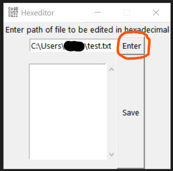
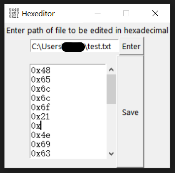
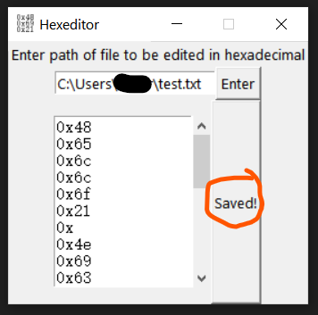

# hexeditor

A hexadecimal editor written in Python just because. I guess I was bored enough to write this thingy

# Usage

To open a file, write the file path into the smaller box (which I hope you can find).

You can then read the file contents. To edit the file, just write the hexadecimal stuffs inside, like so:

It might be helpful to use a [ASCII table](https://www.google.com/search?q=ascii+table) or something. To save the file, simply press "Save":

